# 🔐 VPN Management Tool — Agentic AI on GCP

> An AI-powered IT support agent that handles VPN issues end-to-end — no human helpdesk needed.

---

## What does this agent do?

Before building this, an IT support team had to manually handle every VPN-related complaint — checking access, raising tickets, reactivating accounts. This system automates all of that through a conversational AI agent.

**First, add your VPN guide document to GCS.** Upload your company's VPN reference PDF to a Cloud Storage bucket (this project uses `agenticai-test12345`). The agent uses this as its first source of truth before doing anything else.

When an employee reports a VPN problem, here is exactly what happens — automatically, in a single chat conversation:

1. 🔍 **Searches the VPN guide PDF** for an answer
2. 📋 **Collects employee details** if the guide can't help
3. 🎫 **Creates a support ticket** in Firestore
4. 👤 **Checks the employee's VPN account status** in real time
5. ⚡ **Reactivates the account** if inactive — or registers it if brand new
6. ✅ **Closes or escalates the ticket** based on whether the fix worked

No human in the loop. No delay. One conversation.

---

## Architecture



The system is built in layers, each with a clear responsibility:

| Layer | What it is | What it does |
|---|---|---|
| **Conversational Agents** | GCP's agent platform | Receives the employee's message and runs the agent |
| **Playbooks** | LLM instruction sets | Decides what to do at each step of the conversation |
| **Data Store Tool** | Cloud Storage + search index | Searches the VPN guide PDF |
| **OpenAPI Tool** | HTTP contract definition | Tells the agent how to call Cloud Run |
| **Cloud Run** | Python Flask service | Executes live operations against Firestore |
| **Firestore** | NoSQL database | Stores VPN user records and support tickets |

---

## How the Agent Thinks

This isn't a simple chatbot with scripted responses. It's a **multi-playbook agentic system** — the agent reasons about the situation and decides what action to take next. Here's the decision logic:

```
Employee says something
        │
        ▼
  Is it VPN-related?
  ├── No  → "I only help with VPN issues"
  └── Yes → Search the VPN guide PDF
                │
         Found an answer?
         ├── Yes → Present it. "Did this help?"
         │          ├── Yes → Done. No ticket needed.
         │          └── No  → Collect details → STEP 2
         └── No  → Collect details → STEP 2
                │
         STEP 2: Collect employee ID, name, email, issue
                │
         Is the email valid?
         ├── No  → Ask to correct it
         └── Yes → Call raise_support_case (Cloud Run)
                       │
                Firestore lookup result:
                ├── New user    → Register as active
                ├── Inactive    → Reactivate to active
                └── Active      → No change needed
                       │
                Agent tells employee what happened.
                "Did it work?"
                ├── Yes → Close ticket
                └── No  → Keep ticket open for IT team
```

### Three-state user classification

Every employee lookup returns one of three outcomes, each handled differently:

| State | What it means | What the agent does | What the agent says |
|---|---|---|---|
| `new_user` | Never existed in the system | Creates record as active | "We have registered you in the VPN system" |
| `reactivated` | Existed but was inactive | Flips status to active | "Your account was inactive. We've reactivated it." |
| `found_active` | Already active | No change | "Your account is already active. Please try again." |

---

## Setting Up — Step by Step

### Prerequisites

- GCP project with billing enabled
- `gcloud` CLI installed and authenticated
- A Firestore database named `userentry` in your project
- Your VPN guide PDF uploaded to a Cloud Storage bucket and indexed as a data store in Conversational Agents

---

## Step 1 — Upload your VPN Guide to Cloud Storage

This is the knowledge base the agent searches before doing anything else.

```bash
# Create a bucket
gsutil mb gs://your-bucket-name

# Upload your VPN guide PDF
gsutil cp vpn_user_guide.pdf gs://your-bucket-name/
```

Then in the GCP console, go to **Conversational Agents → Data Stores → Create data store** and point it at your bucket. The platform will index the PDF automatically.

---

## Step 2 — Deploy the Cloud Run Service

The Cloud Run service is the backend that handles live Firestore operations.
You only need two files to deploy — `main.py` and `requirements.txt`.

```bash
cd vpn_management_tool

gcloud run deploy vpn-management-tool \
  --source . \
  --region us-central1 \
  --allow-unauthenticated \
  --set-env-vars GOOGLE_CLOUD_PROJECT=YOUR_PROJECT_ID,FIRESTORE_DATABASE=userentry
```

Once deployed, copy the service URL — you'll need it in Step 4.

**Grant Firestore access to the Cloud Run service:**

```bash
SA=$(gcloud run services describe vpn-management-tool \
  --region=us-central1 \
  --format="value(spec.template.spec.serviceAccountName)")

gcloud projects add-iam-policy-binding YOUR_PROJECT_ID \
  --member="serviceAccount:$SA" \
  --role="roles/datastore.user"
```

**Grant the Conversational Agents platform permission to call Cloud Run:**

```bash
PROJECT_NUMBER=$(gcloud projects describe YOUR_PROJECT_ID \
  --format="value(projectNumber)")

gcloud run services add-iam-policy-binding vpn-management-tool \
  --region=us-central1 \
  --member="serviceAccount:service-${PROJECT_NUMBER}@gcp-sa-dialogflow.iam.gserviceaccount.com" \
  --role="roles/run.invoker"
```

**Verify it's running:**

```bash
curl https://YOUR_CLOUD_RUN_URL/health
# → {"service": "vpn_management_tool", "status": "healthy"}
```

---

## Step 3 — Create the Agent

Go to [conversational-agents.cloud.google.com](https://conversational-agents.cloud.google.com):

```
+ Create agent → Build your own
  Display name: VPN Guide
  Region:       us-central1
  Language:     English
→ Create
```

---

## Step 4 — Create the Tools

Tools are what connect the agent's instructions to real systems.
Create both tools inside your agent under **Tools → + Create**.

### Tool 1: vpn_guide_datastore

This tool searches your VPN PDF. The platform handles all search logic — no code needed.

```
Tool name:   vpn_guide_datastore
Type:        Data store
Description: Searches the VPN policy and guide documents in Cloud Storage
Data stores: → Add → select your indexed data store
→ Save
```

### Tool 2: vpn_management_tool

This tool calls your Cloud Run service. Paste the schema below and replace the URL.

```
Tool name:      vpn_management_tool
Type:           OpenAPI
Description:    Checks employee VPN access and manages support tickets
Authentication: Service agent token
Schema:         → paste openapi_schema.yaml contents (see file in this repo)
→ Save
```

The schema defines three operations the agent can call:

| Operation | Route | What it does |
|---|---|---|
| `raise_support_case` | `POST /raise_support_case` | Creates ticket + checks/activates VPN user in one call |
| `update_ticket` | `POST /update_ticket` | Closes or escalates an existing ticket |
| `check_vpn_user_access` | `POST /check_vpn_user_access` | Standalone VPN status check |

---

## Step 5 — Create the Playbooks

Playbooks are plain English instructions that tell the LLM how to behave.
Create all three inside your agent under **Playbooks**.

### Playbook 1: VPN Support (Routine — Entry Point ★)

This is the supervisor. It handles the full conversation and calls the other playbooks.

```
Open "Default Generative Playbook" → rename to: VPN Support
Type: Routine  (this becomes the default entry point ★)
Goal: You are a helpful IT support assistant for Acme Corp.
      Help employees with VPN-related issues only.
```

Paste these instructions:

```
You are a helpful IT support assistant for Acme Corp.
You only assist with VPN-related issues.
If user asks about something clearly unrelated to VPN
or IT support, say: "I specialise in VPN support for
Acme Corp. Could you let me know if you are facing a
VPN-related issue? I am happy to help!"
For general IT or connectivity complaints like
"network issue" or "internet not working", treat
these as potential VPN issues and search the knowledge base.

STEP 1 - SEARCH KNOWLEDGE BASE FIRST:
- For ANY VPN question, ALWAYS search first using
  ${TOOL:vpn_guide_datastore} with the user's question.
- If a relevant answer is found:
    Present it clearly with the source reference.
    Ask: "Did this resolve your issue?"
    - If user says yes: say "Great! Glad that helped.
      Have a good day!" and end conversation immediately.
      Do NOT create a ticket or call any tool.
    - If user says no or still not working: go to STEP 2.
- If no answer found in knowledge base: go to STEP 2.
- NEVER search the knowledge base more than once for the same issue.

STEP 2 - COLLECT DETAILS:
- Say: "I couldn't find a solution in our knowledge base.
  Please share your employee ID, name, email and a brief
  description of your issue so I can raise a support case."
- Extract employee ID, name, email and issue from whatever
  format the user provides.
- Anything with @ is email. Any alphanumeric ID like qrs-34
  or ert-876 is the employee ID.
- As long as you have employee ID and email, proceed to STEP 3.
- Do NOT ask again if user already provided details.
- If email contains more than one @ symbol or has no dot after @,
  say: "That doesn't look like a valid email address. Could you
  please provide your email in the format name@domain.com?"

STEP 3 - RAISE SUPPORT CASE:
- Use ${TOOL:vpn_management_tool} with operation raise_support_case:
    employee_id:   the employee ID provided
    employee_name: the name provided
    email:         the email provided
    issue_type:    the issue type provided
    description:   the description provided
    ticket_id:     generate as T- followed by 6 random alphanumeric characters
- The tool returns a data.agent_message field.
- Say data.agent_message exactly as returned. Then ask: "Did it work?"
- Do NOT add any other words before or after the agent_message.

STEP 4 - AFTER USER TRIES CONNECTING:
- Only execute STEP 4 if a ticket was created in STEP 3.
  If no ticket exists, do not call update_ticket.
- If user says yes, working, fixed, or resolved:
    Use ${TOOL:vpn_management_tool} with operation update_ticket:
      ticket_id: [ticket ID from STEP 3]
      status: closed
      note: Issue resolved after account status check.
    Say: "Great! I have closed your support ticket. Have a good day!"
- If user says no, not working, or still not working:
    Use ${TOOL:vpn_management_tool} with operation update_ticket:
      ticket_id: [ticket ID from STEP 3]
      status: open
      note: Employee checked but issue persists.
    Say: "I have updated your ticket. Our IT team will investigate
    and get back to you shortly."
```

---

### Playbook 2: VPN Guide Lookup (Task)

Handles searching the PDF. Called by the VPN Support playbook in Step 1.

```
+ Create → Task
Playbook name: VPN Guide Lookup
Goal: Search the VPN guide documentation to answer user questions.
Output parameters: found_in_guide (boolean)
Tools: add vpn_guide_datastore
```

Instructions:

```
- Search ${TOOL:vpn_guide_datastore} with the user's question.
- If a relevant answer is found, present it clearly with the
  source reference. Set output parameter found_in_guide = true.
- If no relevant answer is found, say "I could not find an answer
  in the VPN guide." Set output parameter found_in_guide = false.
- Return immediately. Do not ask any questions. Do not search more than once.
```

---

### Playbook 3: VPN Live Actions (Task)

Handles all Cloud Run calls. Called by VPN Support in Steps 3 and 4.

```
+ Create → Task
Playbook name: VPN Live Actions
Goal: Perform live VPN operations — tickets and user status checks.
Tools: add vpn_management_tool
```

Instructions:

```
- To create a support case and check VPN access, use
  ${TOOL:vpn_management_tool} with operation raise_support_case
  with the parameters provided. Return the full response including
  agent_message, ticket_id and user_action to the caller.

- To update an existing ticket, use ${TOOL:vpn_management_tool}
  with operation update_ticket with the ticket_id, status,
  and note provided. Return the result to the caller.
```

---

## The Cloud Run Service (main.py)

The Flask application has four routes. Three are called by the agent,
one is for infrastructure health checks.

### Routes

| Route | Method | Called by | What it does |
|---|---|---|---|
| `/health` | GET | GCP infrastructure | Returns `{"status": "healthy"}` — confirms service is alive |
| `/raise_support_case` | POST | Agent (STEP 3) | Creates ticket + checks/activates user in one atomic operation |
| `/update_ticket` | POST | Agent (STEP 4) | Closes or updates a ticket with a note |
| `/check_vpn_user_access` | POST | Direct use | Standalone VPN status check and reactivation |

### The core function: `_raise_support_case()`

This is where the magic happens. In a single database transaction it:

1. Writes a new document to `vpn_support_ticket` with all employee details
2. Looks up the employee in `vpn_user_access`
3. Decides which of the three states applies (new / inactive / active)
4. Updates the user record and ticket note accordingly
5. Returns `agent_message` — a complete pre-built sentence for the agent to say verbatim

The reason it does all of this in one call is to keep the conversation
reliable. If the agent had to make two separate calls (create ticket, then
check user), it could lose context or fail partway through. One call,
one atomic result.

### Email validation

The service validates email format before touching Firestore:
- Must have exactly one `@` symbol
- Domain part must contain at least one `.`
- Returns HTTP 400 with a clear message if invalid — the agent picks this up
  and asks the user to correct their email

---

## Firestore Collections

Two collections, one database (`userentry`), linked by `employee_id`.

### vpn_user_access

One document per employee. Document ID is the `employee_id`.

```
vpn_user_access/
└── qrs-34                         ← document ID = employee_id
    ├── employee_id:    "qrs-34"
    ├── employee_name:  "Randy"
    ├── email:          "randy@acme.com"
    ├── status:         "active"   ← active | inactive
    ├── created_at:     "2026-05-29T10:26:02Z"
    ├── updated_at:     "2026-05-29T11:30:00Z"
    ├── note:           "New user registered via ticket T-012345."
    └── last_reactivated_by: "ticket:T-012345"
```

When the agent calls `raise_support_case` for an employee:
- **Document doesn't exist** → created with `status: active`, note says "New user registered"
- **Document exists, status inactive** → updated to `status: active`, `last_reactivated_by` is set
- **Document exists, status active** → no change, agent told to say "already active"

### vpn_support_ticket

One document per support ticket. Document ID is the `ticket_id`.

```
vpn_support_ticket/
└── T-012345                       ← document ID = ticket_id
    ├── ticket_id:      "T-012345"
    ├── employee_id:    "qrs-34"   ← foreign key → vpn_user_access
    ├── employee_name:  "Randy"
    ├── email:          "randy@acme.com"
    ├── issue_type:     "VPN Connection"
    ├── description:    "Cannot connect from home"
    ├── status:         "closed"   ← open | In_Progress | resolved | closed | Pending
    ├── reported_time:  "2026-05-29T10:26:02Z"
    ├── created_at:     "2026-05-29T10:26:02Z"
    ├── updated_at:     "2026-05-29T11:30:00Z"
    └── note:           "Employee reactivated. Issue resolved after retry."
```

The `employee_id` field is the link between the two collections —
you can query all tickets for any employee with a single Firestore filter.

---

## Real Conversation Examples

### The guide solves it instantly

```
Employee: "How do I configure MTU size for Forcepoint VPN?"

Agent:    [searches guide]
          "You can adjust the MTU size by right-clicking the Forcepoint
           VPN Client icon and selecting Properties → Advanced.
           Source: VPN User Guide, page 23."
          "Did this resolve your issue?"

Employee: "Yes, thank you!"

Agent:    "Great! Glad that helped. Have a good day!"
```
No ticket. No Cloud Run call. Done in seconds.

---

### New employee, account created automatically

```
Employee: "I can't connect to VPN"

Agent:    [searches guide — finds general troubleshooting steps]
          "You can try adjusting VPN settings... Did this resolve your issue?"

Employee: "No"

Agent:    "I couldn't find a solution. Please share your employee ID,
           name, email and a brief description of your issue."

Employee: "emp-001, John Smith, john@acme.com, VPN not connecting"

Agent:    [calls raise_support_case — emp-001 not found in Firestore]
          "I've created ticket T-ABC123 for you. You are a new user.
           We have registered emp-001 in the VPN system and your
           account is now active. Please try connecting now. Did it work?"

Employee: "Yes it works!"

Agent:    [calls update_ticket — status: closed]
          "Great! I have closed your support ticket. Have a good day!"
```

---

### Inactive account reactivated

```
Employee: "VPN access denied"

Agent:    [guide doesn't have a match]
          "Please share your details so I can raise a support case."

Employee: "qrs-34, Randy, randy@acme.com, access denied"

Agent:    [calls raise_support_case — qrs-34 found with status: inactive]
          "I've created ticket T-XYZ789 for you. Your account qrs-34
           was inactive. We have reactivated it back to active.
           Please try connecting now. Did it work?"

Employee: "Still not working"

Agent:    [calls update_ticket — status: open]
          "I have updated your ticket. Our IT team will investigate
           and get back to you shortly."
```

---

### Invalid email caught gracefully

```
Employee: "emp-002, sarah@acme@corp.com, Sarah, VPN issue"

Agent:    "That doesn't look like a valid email address. Could you
           please provide your email in the format name@domain.com?"

Employee: "sarah@acme.com"

Agent:    [proceeds normally with corrected email]
```

---

## Project Files

```
vpn_management_tool/
│
├── main.py                 # The Cloud Run Flask app — all backend logic
├── requirements.txt        # Python dependencies (Flask, gunicorn, Firestore)
├── Dockerfile              # Container build instructions
├── deploy.sh               # One-command deployment script
├── openapi_schema.yaml     # Paste this into the Conversational Agents tool
├── architecture.svg        # System architecture diagram
├── .gitignore              # Keeps credentials and cache out of Git
└── README.md               # This file
```

> **Note:** Playbook instructions live in the Conversational Agents console
> and are not version-controlled here. Export them manually from the console
> if you need a backup.

---

## Environment Variables

| Variable | Example Value | Why it's needed |
|---|---|---|
| `GOOGLE_CLOUD_PROJECT` | `testingproject-456103` | Tells the Firestore client which GCP project to connect to |
| `FIRESTORE_DATABASE` | `userentry` | The named database — without this it defaults to `(default)` and can't find your collections |

---

## Common Issues

**Agent says "Sorry something went wrong" repeatedly**
The OpenAPI schema in the tool definition is missing the operation the agent is trying to call. Open the tool in Conversational Agents, check the schema, and confirm all three paths (`/raise_support_case`, `/update_ticket`, `/check_vpn_user_access`) are present.

**Cloud Run returns 404 on `/`**
Expected — there is no route defined for the root path. Use `/health` to test liveness.

**Firestore writes go to the wrong collection**
Check that `FIRESTORE_DATABASE=userentry` is set in your Cloud Run environment variables. If missing, the client connects to the `(default)` database and creates new collections there instead.

**Agent creates a new user entry even though the employee exists**
The employee ID passed to `raise_support_case` doesn't match the Firestore document ID exactly. Document IDs are case-sensitive. Confirm the employee typed their ID correctly.
